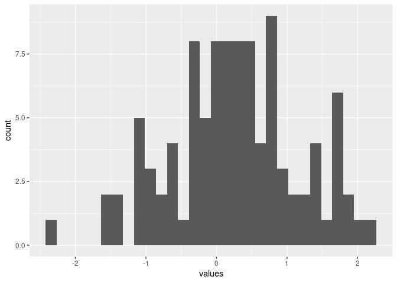

<!-- README.md is generated from README.Rmd. Please edit that file -->

# UN.plot.package

<!-- badges: start -->
<!-- badges: end -->

The goal of UN.plot.package is to generate any number of values from
either uniform distribution or normal distribution. Plot the histogram
for those values.

## Installation

You can install the released version of random.plot.package from
[CRAN](https://CRAN.R-project.org) with:

``` r
install.packages("UN.plot.package")
```

## Example

This is a basic example which shows you how to generate 100 values from
normal distribution and uniform distribution. In addition, this example
shows you the result histograms for these 100 values:

``` r
library(UN.plot.package)
## basic example code
rn <- random_normal(100)
ru <- random_unif(100)
```

The part of the result values generated from both normal distribution
and uniform distribution

``` r
head(rn$values)
#>        values
#> 1 -0.08897653
#> 2  0.56434670
#> 3 -2.05657884
#> 4 -0.83166971
#> 5 -1.20495481
#> 6  0.48378487
head(ru$values)
#>        values
#> 1 0.008297594
#> 2 0.371194218
#> 3 0.150633305
#> 4 0.934076874
#> 5 0.555988013
#> 6 0.737851904
```

The histograms corresponding to the result values

``` r
rn$plot
```



``` r
ru$plot
```


